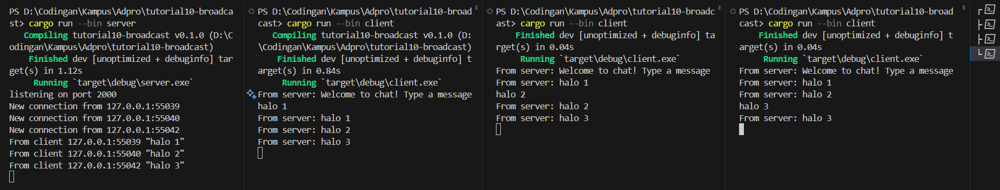

### 2.1. Original code of broadcast chat

First we run the server by doing `cargo run --bin server` and make 3 client by doing `cargo run --bin client` on 3 seperate terminals. Then type something on the client. Notice that when we type something on the client, the server listens and other client will receive the message too.
