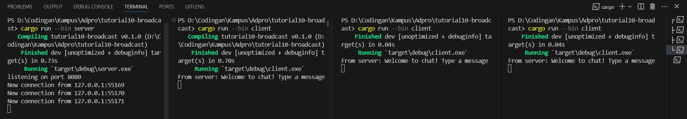
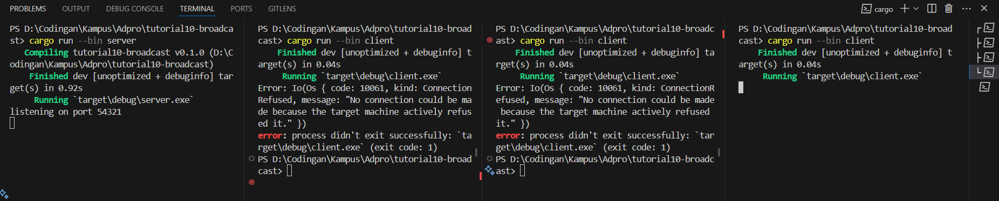

### 2.1. Original code of broadcast chat

First we run the server by doing `cargo run --bin server` and make 3 client by doing `cargo run --bin client` on 3 seperate terminals. Then type something on the client. Notice that when we type something on the client, the server listens and other client will receive the message too.

### 2.2. Modifying the websocket port

Notice that everything works fine. This is because I changed every port on client and server to be `8080`. But, an important thing to note is that if I try to change one of the port to be different than what it's trying to listen or send, it will cause error. Look at the screenshot below:

